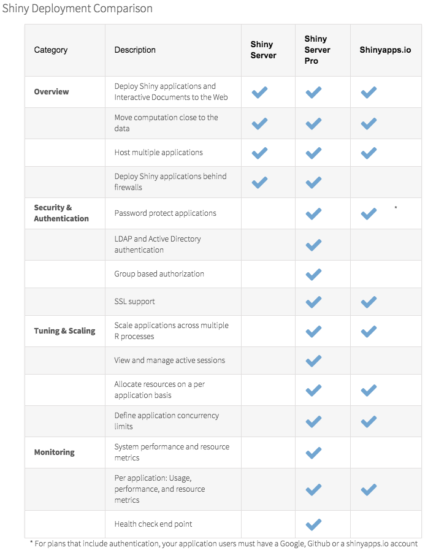
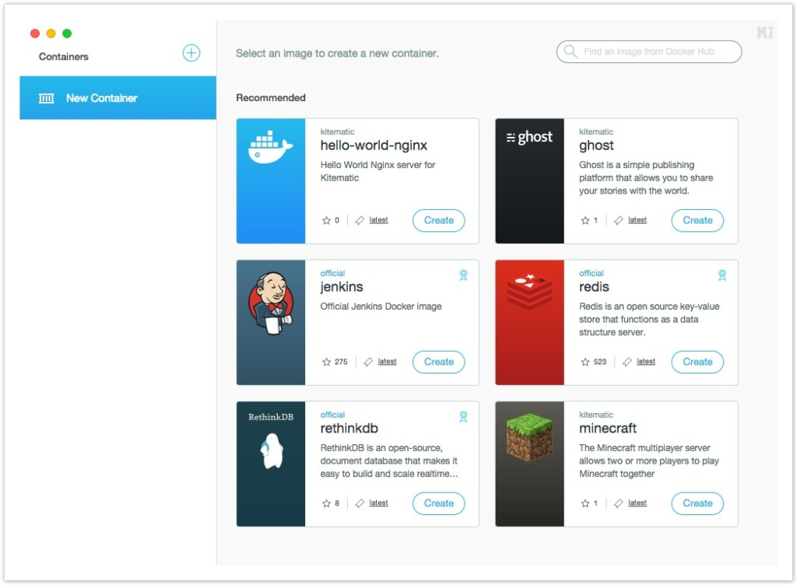

---
layout: post
title: R Web App Development, Deployment, and Distribution
author: Olivia Sung
date: Dec 8, 2015
tags: [R, Shiny, Kitematic, Docker]
comments: true
---

---
As `R` language is becoming popular among scientists to build simple we bapplication along simple integration with `RShiny`, `R` web applications are being created at a fast rate. `RShiny` package is not only easy to integrate but also provides a lightweight user interface that is pleasing to the eyes.

How is `R` application developed?

What is the process to deploy and distribute `R` web applications?
---

Development
--

While web development can be done in many different environments, [RStudio](https://www.rstudio.com/) is widely used to develop `R` applications. Below is a snapshot of what RStudio looks like.

> 

Deployment 
--

#### Portable Applications

For light `R` application that only needs a local deployment, `R` portable and web browser portable such as `Chrome` applications can be used. It does not require as much performance on end user's side and overall distribution will result in smaller files.

*Refer to [this](http://www.r-bloggers.com/deploying-desktop-apps-with-r/) blog post by Lee Peng about Deploying Desktop Apps with R using portable apps*

*Refer to [this post](http://blog.analytixware.com/2014/03/packaging-your-shiny-app-as-windows.html) to package your `Shiny` application as Windows application*

#### Shiny Server

If you want to put your `Shiny` application on web, you can host it using Shiny Server. You would need to install, configure and manage the server yourself which could be complicated for some users.

If you want an ultimate experience of `RShiny`, there is also a paid service [RShiny Server Pro](https://www.rstudio.com/products/shiny-server-pro/), where you can host your application on `Shiny` server. 
There are a few useful functionalities that comes with the service such as 

- User Access Control
- Monitor application performance 
- Monitor resource utilization 

However service is not cheap so if you have extra cash lying around, this would be a quick and easy way to host your application!

*Refer to [this](https://www.rstudio.com/products/shiny/shiny-server/) to find out more about `Shiny Server`*

#### Shinyapps.io

`shinyapps.io` is a multi-tenant platform as a service (PaaS) for hosting `Shiny` web applications. However it can also be expensive since the free edition can be limited depending on your needs.

*Refer to [this](http://shiny.rstudio.com/articles/shinyapps.html) where you can discover how to get started with `shinyapps.io`*

**If you cannot decide between `shinyapps.io` and `Shiny Server Pro`, refer to this [FAQ](https://www.rstudio.com/faq-items/difference-shinyapps-shiny-server/)**

**See below feature comparion chart between `Shiny Server`, `Shiny Server Pro` and `shinyapps.io` taken from this [page](https://www.rstudio.com/products/shinyapps/)**

> 

#### Docker

Docker containers wrap up a piece of software in a complete filesystem that contains everything it needs to run:

- Code
- Runtime
- System tools
- System libraries
- Anything you can install on a server

This guarantees that it will always run the same, regardless of the environment it is running in.
While this can be done with a virtual machine, `Docker` does not use a full OS, it shares the same host kernel meaning that it needs to run on Linux, but it is completely isolated environment. Since `Docker` containers are lighter than virtual machines, it makes testing much easier because you can always scrap that instance after!

Docker can come in handy because you can create a `Shiny` server using few commands which simplifies deployment of a server.

*Refer to [this blog post](http://www.rmining.net/2015/04/30/dockerizing-a-shiny-app/) to get your `Shiny` app 'dockerized'.*

Distribution
--

If your end user has `RStudio`. then you can share your `R` files (ui.R and server.R) so that end user can run it through `RStudio`.

If you have your own server, whether it be `AWS`, `Google Cloud`, `Microsoft Azure`, you can share it there.

#### Docker + Kitematic

After you have 'dockerized' your `Shiny` application, you can share it on `Kitematic`.
`Kitematic` is a GUI where users can upload and download `Docker` images to run it in their `Docker` containers.
This makes distributing very simple and easy as `Docker Hub` can work like `App Store`!
Below is a snapshot of Kitematic.

> 

*Refer to [this blog post](http://www.r-bloggers.com/share-your-shiny-apps-with-docker-and-kitematic/) to learn how you can share your `Shiny` application with `Docker` and `Kitematic`*

#### GitHub

You can share your code in a repository where other users can contribute by suggestions, corrections and additions.
When another user clones your repository, the directory structure is kept so that all data is preserved as where they belong.

#### R Package

If you are an awesome R programmer, creating a `R` package is an useful way to distribute and share within `R` community.
`R` packages are stored in `Comprehensive R Archive Network (CRAN)` repository where there is extra level of testing to enforce certain structure so users can ensure quality packages.
